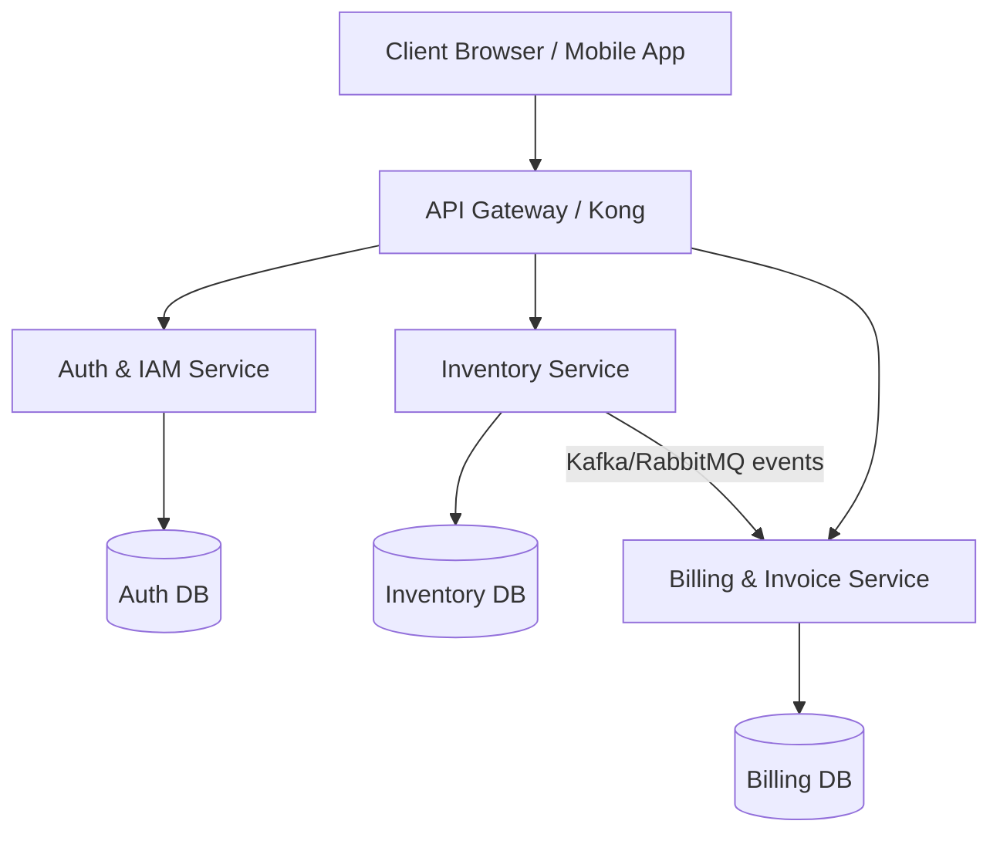

# System Design & Scalability Note

This document outlines how the **WarehouseOS WMS** application is designed for horizontal/vertical scaling, database performance, caching, and future migration to microservices.

---

## 🏗️ 1. Scaling the API Layer (Horizontal & Load Balancing)

To scale the backend beyond a single virtual machine:
1. **Stateless Backend**: The FastAPI backend is completely stateless (authenticating via cryptographically signed JWT tokens, storing no local sessions). This allows us to spin up multiple instances (replicas) of the backend.
2. **Reverse Proxy & Load Balancing (Nginx / HAProxy)**: 
   - Deploy Nginx or HAProxy as a load balancer in front of multiple backend replicas.
   - Use round-robin or least-connections routing algorithms.
   - **Nginx Config Example**:
     ```nginx
     upstream backend_servers {
         server backend1:8000;
         server backend2:8000;
         server backend3:8000;
     }
     server {
         listen 80;
         location /api/v1/ {
             proxy_pass http://backend_servers;
         }
     }
     ```
3. **ASGI Server Tuning**: Run Uvicorn workers using Gunicorn (e.g. `gunicorn -w 4 -k uvicorn.workers.UvicornWorker app.main:app`) to scale concurrent connection handling across multi-core CPU architectures.

---

## ⚡ 2. Caching Layer (Redis Integration)

To handle high read traffic (e.g. global inventory views, employee listing, and statistics):
1. **Caching Database Queries**: Integrations with Redis cache standard stats endpoints (like `GET /api/v1/inventory/admin/stats` and `GET /api/v1/bills/admin/stats`). Cache duration: 5–15 minutes (or invalidate caches when new items are added / bills are updated).
2. **Rate Limiting**: Use Redis to store request counters per IP/user to prevent brute-force attacks on `/auth/login` and rate-limit write-heavy endpoints like `/bills/` and `/inventory/`.
3. **JWT Blacklisting**: For security, if an employee is deactivated, blacklist their active token JTI/subject in Redis (with TTL set to the token's expiration) to instantly invalidate active sessions globally.

---

## 🗄️ 3. Database Scaling & Optimization (PostgreSQL)

When database reads/writes become a bottleneck:
1. **Connection Pooling**: Use **PgBouncer** in transaction mode. Python/SQLAlchemy direct pooling can exceed Postgres' max connection limit when scaling to dozens of backend containers.
2. **Read/Write Splitting**: 
   - Direct all `POST/PATCH/DELETE` queries to a PostgreSQL **Primary instance**.
   - Set up **Read Replicas** using streaming replication and direct all listing/statistics reads (`GET` endpoints) to the read replicas.
3. **Indexes**:
   - Index the `email` field on the `users` table (already in place).
   - Index foreign keys: `added_by` in `inventory_items`, `created_by` in `bills`, and `bill_id`, `inventory_item_id` in `bill_items`.
   - Index composite search keys (e.g. category, created_at) to speed up sorted, paginated API searches.
4. **Data Partitioning**: Partition the `bills` and `bill_items` tables by `created_at` date ranges (e.g., monthly/yearly partitions) to maintain small index sizes and fast queries.

---

## 🔗 4. Decoupling into Microservices

As the product scope expands, the monolithic layout under `app/modules` can be split into microservices:



1. **Authentication & Identity Service**: Dedicated user profile management, login/register, JWT issue/verify.
2. **Inventory Management Service**: Handles item catalog, categorization, tracking warehouse stock levels.
3. **Billing/Dispatch Service**: Handles bill creation and billing history. It subscribes to **Inventory Stock Updates** using a message broker (RabbitMQ / Kafka) to coordinate atomic inventory stock reduction when a bill is created.
